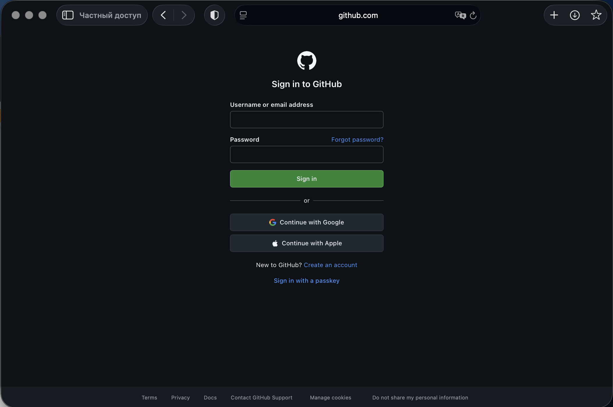
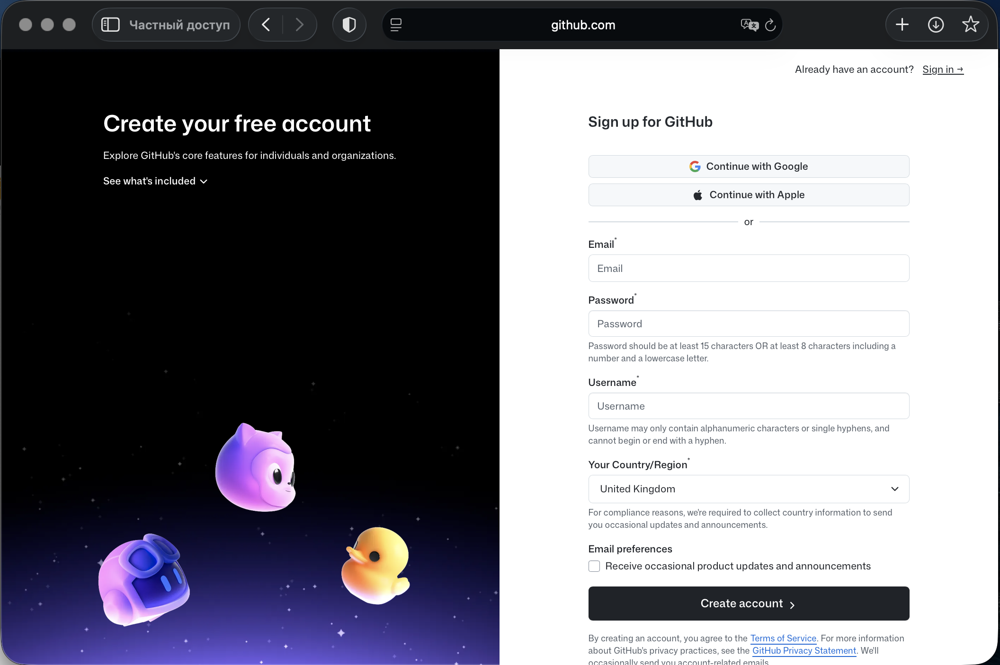
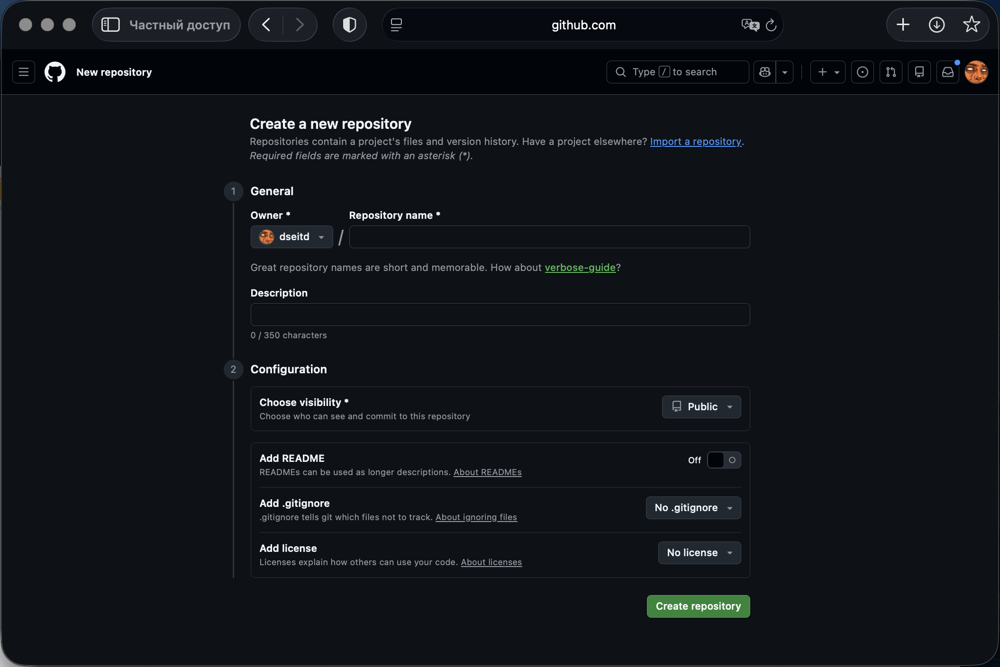
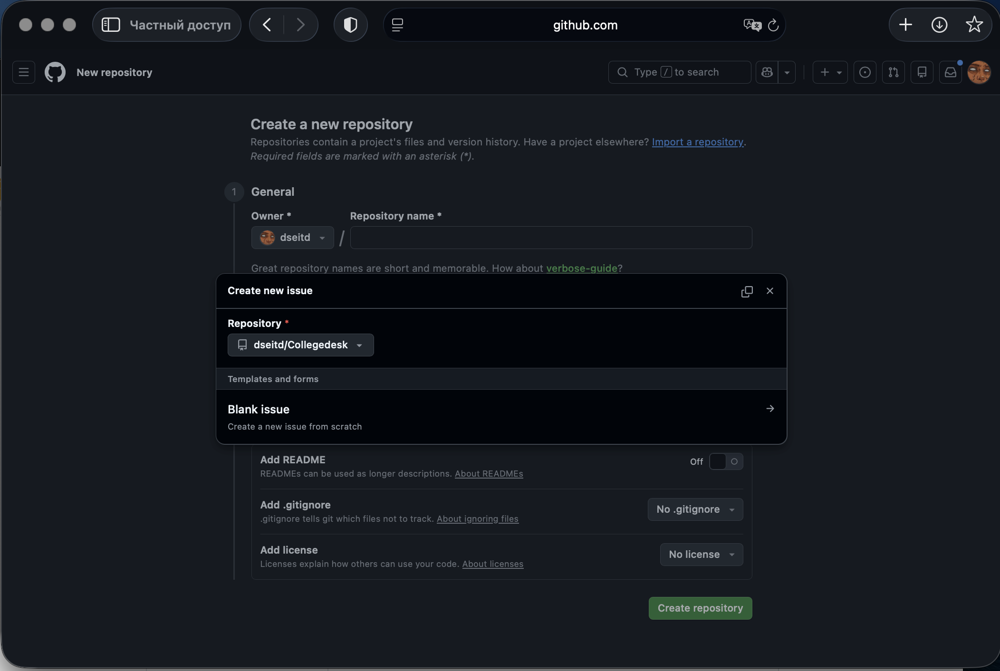
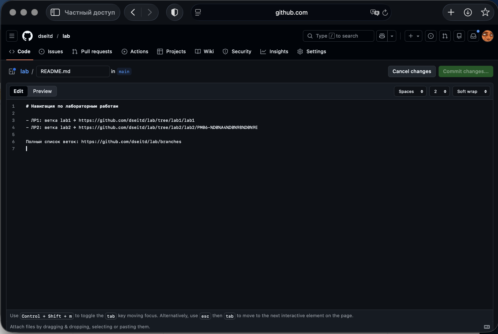
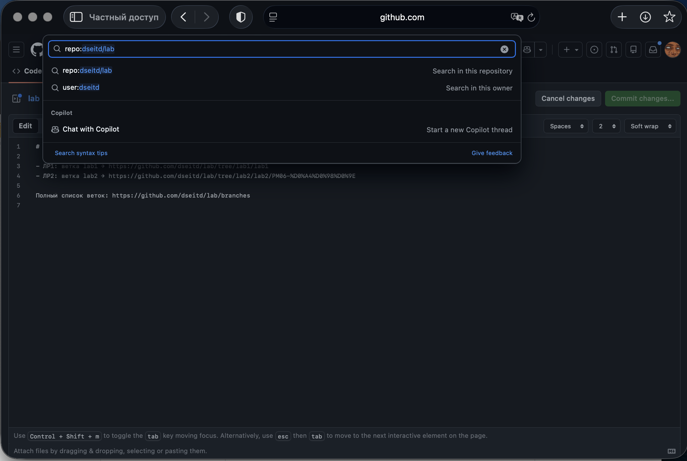

# Инструкция пользователя (ЛР5) — GitHub

## Назначение системы
GitHub — платформа для хостинга репозиториев, совместной разработки, управления задачами и документацией.

## Начало работы
- Вход:
  - Перейдите на https://github.com/.
  - Нажмите Sign in, введите email/логин и пароль, подтвердите.
- Регистрация:
  - Нажмите Sign up на https://github.com/.
  - Заполните email/логин/пароль, следуйте шагам подтверждения.
- Восстановление пароля:
  - На странице входа выберите Forgot password.
  - Введите email, подтвердите письмо и задайте новый пароль.

## Основные функции
- Добавление записи:
  - Создать репозиторий: кнопка New → заполнить имя, видимость → Create repository.
  - Создать задачу (issue): вкладка Issues → New issue → оформить и сохранить.
- Редактирование:
  - Изменить файл: открыть файл в репозитории → Edit → внести правки → Commit changes.
  - Редактировать issue: открыть задачу → Edit → обновить поля → Save.
- Поиск:
  - Поиск по всей платформе: верхнее поле Search → ввод запроса → фильтры Repositories/Issues/Code.
  - Поиск по репозиторию: вкладка Code/Issues, строка поиска и фильтры.

## Завершение работы
- Нажмите на аватар → Sign out.
- Закройте вкладку браузера при необходимости.

## Скриншоты
- Снимите экраны входа, регистрации, создания репозитория и issue, редактирования файла, поиска.
- Сохраните файлы в папку screenshots/ и вставьте ссылки ниже:
  - 
  - 
  - 
  - 
  - 
  - 
