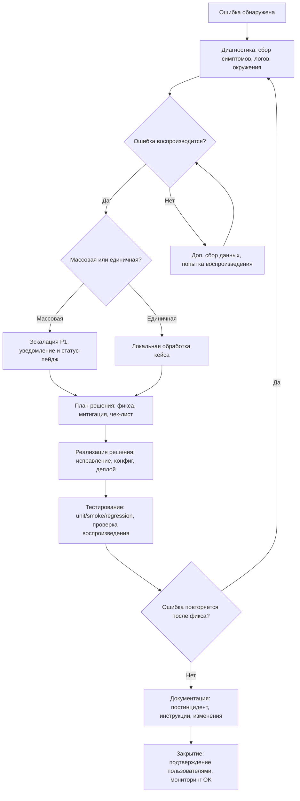

# Диаграмма процесса сопровождения (ЛР8)

## Описание
Диаграмма отражает жизненный цикл обработки инцидента: от появления ошибки до её закрытия, включая диагностику, реализацию решения, тестирование и документирование. Добавлены ветвления: повторяется/не повторяется, массовая/единичная.

## Диаграмма (Mermaid)

## Примечания
- При «не воспроизводится»: усиливаем диагностику (логирование, трейсинг, изоляция окружения) до подтверждения.
- Для массовых инцидентов: обязательны коммуникации, статус‑страница и временные обходы (workaround) до полного устранения.
